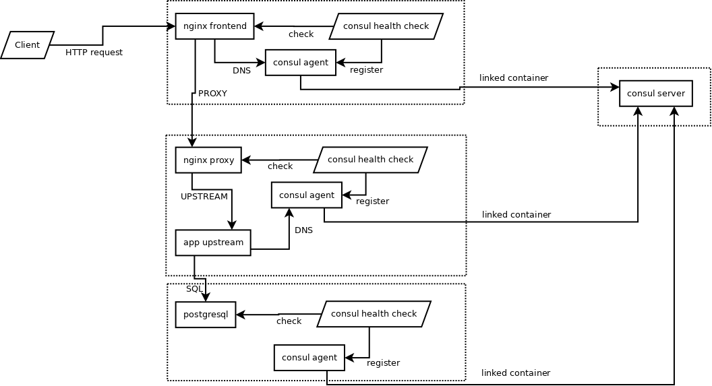

# ConSup - инфраструктура docker на основе consul и supervisord

Проект для создания и эксплуатации серверных приложений с помощью контейнеров [Docker](https://www.docker.com/)

## Особенности

* Все контейнеры docker публикуются как [автоматические билды](https://registry.hub.docker.com/u/lekovr/), вся приватная информация размещается в каталоге, являющимся текущим при запуске контейнера
* Каждый контейнер представляет собой логический сервис, который может состоять из нескольких процессов. Например, сервис [postgresql](Dockerfiles/postgres/README.ru.md), кроме СУБД, содержит сервер [dbcc](https://github.com/LeKovr/dbcc) для автоматического создания БД и пользователей. Эти процессы управляются [supervisor](http://supervisord.org/)
* Взаимодействие между контейнерами осуществляется с помощью [consul](https://www.consul.io/) (каждый контейнер линкуется с контейнером consul и содержит в своем составе consul agent, который дополнительно выполняет функции Health check сервисов контейнера)
* Совместно используемые контейнеры описываются как зависимости. Например, единственный запущенный контейнер postgres может использоваться несколькими другими контейнерами. При старте контейнера его зависимости запускаются автоматически.
* Конфигурация контейнеров задается в yml-файлах, трансляция которых в аргументы docker производится bash-скриптом [fidm](https://github.com/LeKovr/fidm)

## Зависимости

* linux 64bit
* [docker](https://www.docker.com/)
* [fidm](https://github.com/LeKovr/fidm)

## Поддерживаемые сервисы

Системные
* [consul](Dockerfiles/consul/README.ru.md) - сервис регистрации, мониторинга контейнеров и key-value хранилище конфигураций
* [nginx](Dockerfiles/nginx/README.ru.md) - фронтенд http-сервисов, автогенерация сертификатов [Let's Encrypt](https://letsencrypt.org/), сервис статических сайтов
* [postgresql](Dockerfiles/postgres/README.ru.md) - СУБД Postgresql

Прикладные
* [consul-ui](Dockerfiles/consul/skel/README.ru.md) - Web-интерфейс с consul
* [webhook](Dockerfiles/webhook/skel/README.ru.md) - сервис Continuous integration
* gitbook - генерация статического сайта документации по файлам Markdown
* [gogs](Dockerfiles/gogs/skel/README.ru.md) - управление Git
* mattermost - платформа обмена сообщениями
* pdns - DNS-сервер

См. также: [Dockerfiles/*/](Dockerfiles/)

## Схема инфраструктуры consup



## Установка

Установка производится на хост с 64bit linux (64bit - это требование docker).

### Установка **make** и **wget**

Ниже описывается вариант для apt-based ОС (Debian, Ubuntu), в других дистрибутивах установка make и wget производится аналогично.

При установке пакета потребуется пароль для sudo.

```
which make > /dev/null || sudo apt-get install make
```

Если в системе не установлен wget, он ставится аналогично:

```
which wget > /dev/null || sudo apt-get install wget
```

### Установка **docker**, **fidm**, **consup**

Загрузка Makefile и конфигураций fidm:

```
cd /opt
wget -qO- https://raw.githubusercontent.com/LeKovr/consup/master/install.sh | sh
```

Установка **docker** и **fidm** (потребуется пароль для sudo)

docker будет установлен согласно [инструкции](http://docs.docker.com/linux/step_one/). Если такой вариант не подходит, надо предварительно поставить docker вручную.

```
cd /opt/consul
make deps
```

Для того, чтобы текущий пользователь мог работать с docker, его надо добавить в группу docker:
```
sudo usermod -a -G docker $USER
```

## Лицензия

The MIT License (MIT), see [LICENSE](LICENSE).

Copyright (c) 2016 Alexey Kovrizhkin lekovr@gmail.com
